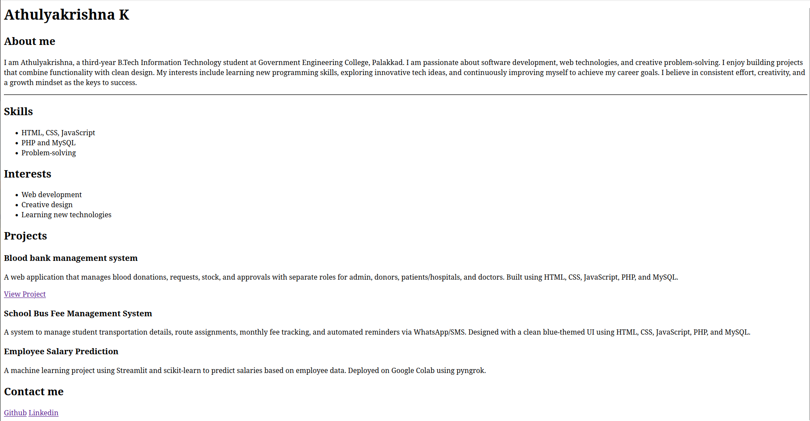

# Personal Portfolio Website

This is a simple personal portfolio website created using **HTML** as part of my internship assignment.  
It includes sections such as **About Me**, **Skills**, **Interests**, **Projects**, and **Contact Me**.

## 📌 Features
- **About Me** section with personal introduction
- **Skills** and **Interests** listed using HTML lists
- **Projects** with descriptions and GitHub links
- **Contact Me** section with social links

## 📂 Project Structure
portfolio/

│

├── index.html # Main HTML file

├── output.png # Screenshot of the portfolio

└── README.md # Project documentation

## 💻 Output
Here is a preview of the portfolio:

 ## 🌐 Live Demo
 

 
